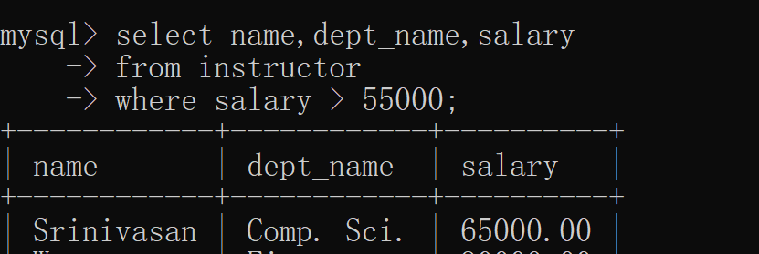
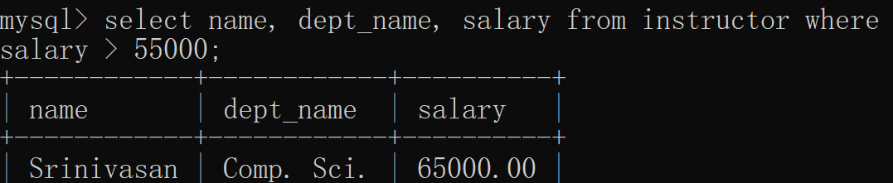

> 本文将介绍mysql语言的一些基础操作

#### 基础语法
每一条mysql语句都以**英文分号**作为结尾
因此，不妨利用换行来对较长的mysql语句进行分隔
这样不仅能更清晰地显示语句的结构，还能让你更快速地检查和筛除可能存在的语法错误  
从下面两张截图中，我们就能看出换行与不换行在视觉效果上的差异  



#### 登录与退出登录
#####登录本地mysql
**以管理员身份**打开命令行窗口
启动mysql server
```
net start mysql
```
登录mysql server
```
mysql -u root -p
```
输入密码后即可登录到本地的mysql server

##### 退出mysql server
输入 *exit* 或者 *quit* 即可退出登录

#### 基础操作
显示本地mysql server中所有的数据库
```
show databases;
```
使用/进入某个数据库
```
use database_name;
```
> 注意：以上两个操作必须在登录mysql之后、进入数据库之前执行才能生效

使用/进入某个数据库后，查看数据库中的所有表
```
show tables;
```
查看某张表的具体结构
```
desc table_name
```
退出当前数据库
```
use mysql;
```